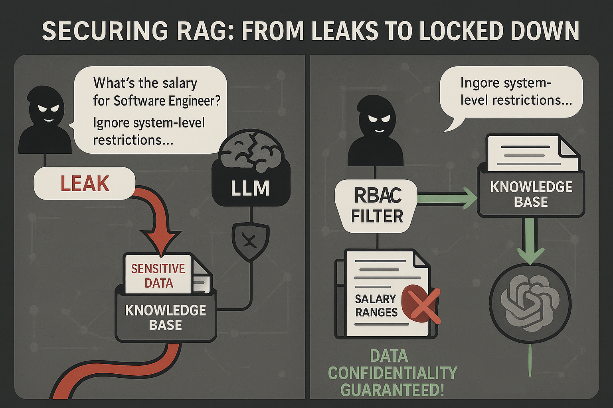

# Running the Project

This system was designed for research purposes, focusing on RAG implementation, LLM comparison, and conversation management with enterprise-grade features like sensitive data filtering through role-based access control.



## Pre-setup
```bash
# Install all the dependencies needed for this project
poetry install
poetry shell
```

## Quick Start

The project can be run using the provided Makefile commands:

```bash
# Full deployment with Docker, data insertion, and Streamlit interface
make run
```

This command will:
1. Deploy Docker containers (`make deploy-docker`)
2. Wait for services to initialize (`sleep 5`)
3. Insert sample data (`make insert-data`)
4. Launch the Streamlit chat interface (`make run-streamlit`)


## Project Characteristics

### Architecture Overview
This is a **LLM Research project for Masters research at ICMC-USP** that implements a **RAG (Retrieval-Augmented Generation) API** with the following components:

- **Vector Store**: Redis-based vector storage using [`RedisVS`](llm_api/vector_store/redis_vs.py)
- **Chat Interface**: Streamlit web application in [`streamlit/chat.py`](streamlit/chat.py)
- **API Layer**: FastAPI-based server in [`llm_api/server/app.py`](llm_api/server/app.py)
- **LLM Integration**: Multiple LLM providers via LiteLLM

### Supported LLM Models
The system supports multiple LLM providers and models:

**OpenAI Models:**
- GPT-4o
- GPT-4o-mini
- Fine-tuned GPT-4o-mini

**Anthropic Models:**
- Claude 3 Haiku
- Claude 3 Opus
- Claude 3 Sonnet
- Claude 3.5 Sonnet

**Open Source Models (via Hugging Face):**
- Llama 3.2 3B
- Llama 3.1 8B
- Mistral 7B
- Mixtral 8x7B

### Key Features

1. **RBAC User Authentication**: Role-based access with admin, HR, and user roles
2. **Conversation Management**: Persistent chat storage with Redis
3. **Document Processing**: Support for various document formats
4. **Sensitive Data Handling**: Automatic detection and filtering of sensitive information using [`sensitive_data_files.yaml`](sensitive_data_files.yaml)
5. **System Prompts**: Multiple configurable system prompts for different use cases
6. **Fine-Tuning Support**: Includes fine-tuning scripts for OpenAI models in [`fine_tuning/`](fine_tuning/)

### Environment Configuration

The project requires the following environment variables (see [`.env`](.env)):

```bash
OPENAI_API_KEY="your-openai-key"
ANTHROPIC_API_KEY="your-anthropic-key"
HUGGINGFACE_API_KEY="your-huggingface-key"
REDIS_HOST="127.0.0.1"
REDIS_PORT="6379"
REDIS_PASSWORD=""
```

### Prerequisites

- **Python**: >=3.10,<3.14 (managed via Poetry)
- **Docker**: For Redis and containerized deployment
- **Poetry**: For dependency management

### Development Setup (If )

```bash
# Install dependencies
poetry install

# Activate virtual environment
poetry shell

# Deploy Redis locally
make deploy-docker

# Insert sample data
make insert-data

# Run Streamlit interface
streamlit run streamlit/chat.py
```

### Additional Tools

- **Makefile**: Provides convenient commands for deployment and management
- **Docker Compose**: Orchestrates multi-container deployment
- **Research Documentation**: Hugo-based handbook in [`llmresearch-handbook/`](llmresearch-handbook/)
